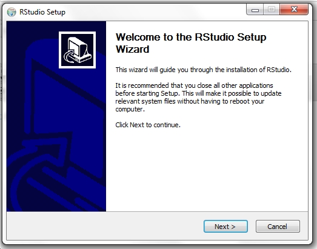
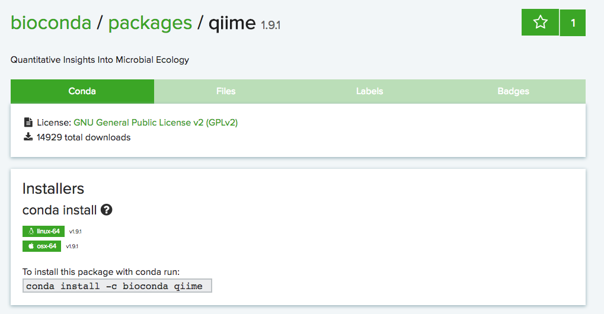
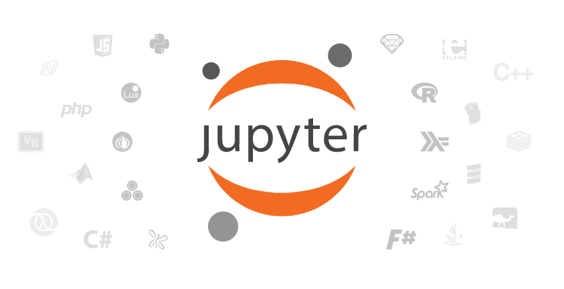

## Curso de boas práticas computacionais para biólogos: Sobrevivendo na era digital

### Sumário

**Introdução:**

[I.1 Apresentação](./introdução.md/### I.1 - Introdução)  
[I.2 Informática cada vez mais necessária](./introdução.md/### I.2 Quem não aprender isso, provavelmente vai ficar para trás...)     
[I.3 Boas práticas computacionais e reprodutibilidade](./introdução.md/### I.3 Macaco vê, macaco faz)  
[I.4 As ferramentas](./introdução.md/### I.4 Ferramentas básicas da computação científica)

**Módulo 1:**

[1.1 - Linha de comando: Terminal](./Módulo\ 1.md/### 1.1 Linha de comando: bash e o Terminal)  
[1.2 - Editor de texto e IDE: Atom](./Módulo\ 1.md### 1.2 Editor de texto e IDE: nossa bancada de laboratório digital)	
[1.3 - Linguagem de Programação: Python](./Módulo\ 1.md)

**Módulo 2:**

[2.1 - Conda: Ambientes virtuais e instalação de dependências](./Módulo\ 2.md)  
[2.2 - Bibliotecas essenciais: Jupyter, Pandas e Matplotlib.](./Módulo\ 2.md)  
[2.3 - Plotando dados no Jupyter Notebook](./Módulo\ 2.md)  

**Módulo 3:**

3.1 - Aprendendo a programar como biólogo   

-

## Módulo 2:

### 2.1 Conda: ambientes virtuais e dependências

### Pacotes e bibliotecas

Assim como o R, a capacidade do Python é enormemente expandida por conta da grande quantidade de pacotes e bibliotecas disponíveis. Alguns são essenciais para quem quer realizar análise de dados.

.

[Nesse tópico no site BioStars](https://www.biostars.org/p/50749/#50758), esse usuário apontou algumas ferramentas em Python que são úteis para biólogos.

Logo, é imprescindível aprender a baixar, instalar e rodar esses pacotes. Essa instalação é simples, mas é diferente de usar um "Install Wizard": geralmente é feita pela linha de comando.

Você pode até se safar instalando o RStudio usando um Install Wizard, mas para instalação de pacotes Python vai ter que recorrer ao Terminal.

Além disso, existe outra questão: muitos pacotes dependem de outros para funcionar, e todos dependem de ter uma instância de Python instalada. Pior, às vezes pacotes requerem versões **específicas** de outro pacote ou linguagem, e pacotes que requerem versões **diferentes** podem causar o que chamamos de um **conflito de dependência**.

### Ambientes virtuais: caixinhas no computador

Para instalarmos uma biblioteca, precisamos de um programa que faça isso para nós, um **gerenciador de pacotes**. Por sorte, o Python vem com um instalado de fábrica, o [`pip`](https://pip.pypa.io/en/stable/): pip installs packages. O `pip` faz download e instala pacotes disponíveis no [PyPI - Python Package Index](https://pypi.python.org/pypi), um repositório de bibliotecas aberto mantido pela Python Software Foundation. O `pip` funciona muito bem, no entanto queremos mais que isso.

Para isso instalamos o Anaconda, que é uma plataforma para ciência de dados que inclue um gerenciador de pacotes chamado [`conda`](https://conda.io/docs/index.html). Além de baixar e instalar pacotes, o `conda` também gerencia **ambientes virtuais**.

**Mas o que são e por que precisamos de ambientes virtuais?**

Ambientes virtuais (*virtual environments* ou *envs*), são como caixinhas em nosso computador na qual instalamos programas, pacotes, bibliotecas, ou dependências, e elas funcionam naquele ambiente, sem interferir com outras instalações fora desse ambiente.

**Por exemplo:**

Quando vamos baixar o Anaconda, podemos escolher entre Python versão 2.7 ou 3.4. Digamos que escolhemos a 3.4, por que é mais atualizada e compatível com a maioria dos programas. Porém, estamos fazendo um estudo de microbiologia e para analisar nossos dados, vamos precisar do [QIIME](http://qiime.org/), que requere a versão 2.7 do Python para rodar, e é incompatível com as versões 3.x. Além do Python, o QIIME requere versões específicas de diversas outras bibliotecas, que podem interferir com nosso ambiente **root** (nosso ambiente "global", sem nenhum ambiente virtual ativado).

A solução é **criar um ambiente virtual** com Python 2.7 instalado, e nesse ambiente instalamos as **dependências** necessárias para que o QIIME rode. O `conda` permite que façamos isso.

### Criando um ambiente virtual

Embora a instalação do Anaconda nos propicia o Anaconda Navigator, uma interface gráfica, vamos utilizar o `conda` pelo Terminal.

[Nesse documento](conda-cheatsheet.pdf) temos uma referência rápida dos comandos básicos do `conda`.

Para criar um novo ambiente, usamos o comando `conda create` junto do nome do ambiente e a versão de Python que desejamos.

`conda create --name qiime python=2.7`

Agora que temos um ambiente com a versão que precisamos, podemos instalar o QIIME e o restante de suas dependências.

Ativamos o novo ambiente com o comando:
`source activate qiime`

### Instalando pacotes do Anaconda Cloud

Diferente do `pip`, o `conda` não baixa programas do [PyPI](https://pypi.python.org/pypi), e sim de outra base de dados, a [Anaconda Cloud.](https://anaconda.org/)

Esse repositório é muito útil pois fornece os pacotes disponíveis e os comandos para instalação.

Copiamos o comando e uma mensagem irá confirmar a instalação do QIIME e todas as dependências necessárias.

`conda install -c bioconda qiime`

Acontece que perdemos todas as nossas sequências, então não vamos precisar do QIIME. Vamos aprender sobre outras bibliotecas mais essenciais no momento. Remova o ambiente com o comando:
`source deactivate`
`conda remove -n qiime --all`

Vamos criar um novo repositório para fazer uma análise de dados mais simples. Além da versão do Python, podemos especificar outros pacotes para o `conda` instalar quando criar o ambiente:

`conda create -n tutorial Python=3 Pandas Matplotlib Jupyter`

Selecionamos Python 3, bem como as bibliotecas [Pandas](https://pandas.pydata.org/), [Matplotlib](https://matplotlib.org/), [Jupyter](http://jupyter.org/) e suas dependências.

`source activate tutorial`

### 2.2 Bibliotecas essenciais: Pandas, Matplotlib e Jupyter.

É um equívoco comum, para quem está começando a aprender uma linguagem, pensar que o uso desta por si só vai levar ao resultado final do que se está buscando. Uma linguagem como Python, embora poderosa, necessita um conhecimento extenso para ser utilizada efetivamente sem o auxílio de pacotes externos. 

Para tirar o máximo proveito de um conhecimento básico de Python, vamos alavancar a funcionalidade da linguagem por meio dessas três bibliotecas. Sua combinação vai nos possibilitar um ambiente simples mas efetivo para análise de dados. Se o nosso objetivo fosse outro, como por exemplo, desenvolvimento web, faríamos uso de outros *frameworks*, como [Flask](http://flask.pocoo.org/) ou [Django.](https://www.djangoproject.com/)

[Pandas](https://pandas.pydata.org/) é uma biblioteca de análise contendo ferramentas de análise de dados de fácil uso e alta performance. Vamos utilizar **métodos** dessa biblioteca para importar e manipular nossos dados.

[Matplotlib](https://matplotlib.org/) é uma biblioteca de plotagem inspirada no MATLAB, com a diferença de ser de graça e *open source*. Oferece uma variedade de ferramentas para plotar os dados que criamos com Pandas.

[Jupyter](http://jupyter.org/) é uma biblioteca muito interessante que nos fornece o [Jupyter Notebook](https://github.com/jupyter/jupyter/wiki/A-gallery-of-interesting-Jupyter-Notebooks), uma ferramenta muito útil para organizar um projeto de análise de dados.

Um arquivo Jupyter Notebook permite a *execução de código* junto com texto MarkDown, como html. Vamos realizar nossa análise com Pandas, plotar com Matplotlib e anotar e organizar tudo com anotações utilizando o Jupyter Notebook.

O arquivo [Python - primeiros comandos.html](Python - Primeiros comandos.html) foi renderizado a partir de um arquivo Notebook. Vamos abrir o arquivo [Módulo 2 - continuação.ipynb](Módulo 2 - continuação.ipynb). Mas para isso precisamos abrir uma instância de Jupyter.

No Terminal, digite `Jupyter Notebook` para abrir uma página no seu navegador web.

-