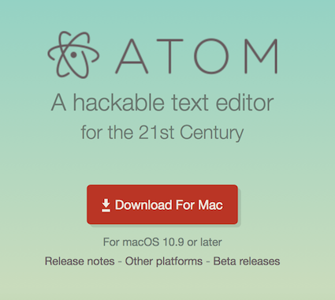
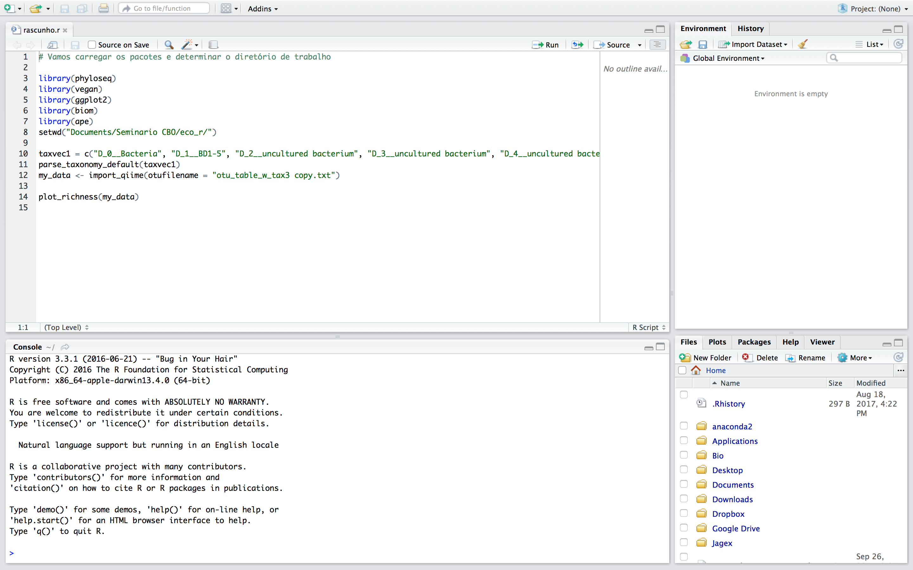
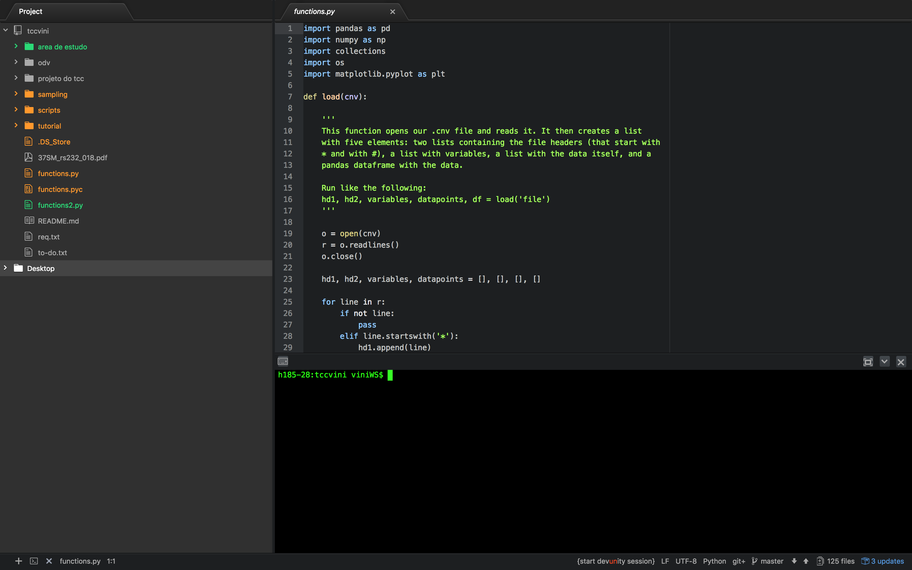

## Computação científica para biólogos

### Sumário

[**Introdução: o porquê deste curso**](./Introdução.html)

I.1 Apresentação  
I.2 Informática cada vez mais necessária  
I.3 As ferramentas

[**Módulo 1: Ferramentas básicas**](./Módulo 1.html)

1.1 - Linha de comando: Terminal  
1.2 - Editor de texto e IDE: Atom	
1.3 - Linguagem de Programação: Python

[**Módulo 2: Bibliotecas e ambientes virtuais**](./Módulo 2.html)

2.1 - Conda: Ambientes virtuais e instalação de dependências  
2.2 - Bibliotecas essenciais: Jupyter, Pandas e Matplotlib.  
2.3 - Analisando o conjunto Iris no Jupyter Notebook  

[**Módulo 3: Colaboração e boas práticas**](./Módulo 3.html)

3.1 - Boas práticas em computação científica  
3.2 - Documentação e controle de versão: Git e GitHub  
3.3 - Como aprender programação: dicas para biólogos

-
## Introdução

### I.1 - Apresentação

Por que você está aqui?

O que te levou a querer fazer esse curso?

Quem aqui já programou antes?

Diferença entre programar x desenvolver

'Tudo' em nosso computador é um programa

Entrada (*input*) > Ação (*processamento*) > Saída (*output*) 

Computadores são ferramentas essenciais para quase todos os profissionais, mas especialmente para cientistas/pesquisadores, e precisamos aprender a usa-los com proficiência, seja para 'programar' ou somente para instalar e fazer uso de programas. 

No meu curso, aprendi muito de diversas áreas da bio. Aprendemos como empregar diversas técnicas e ferramentas que são essenciais para um biólogo. Em biologia celular, como montar uma lâmina e operar o microscópio. Em ecologia de comunidades, amostrar vegetação no campo com transectos. Em biologia molecular, como fazer uma extração de DNA e 'correr' um gel de eletroforese. Porém, não nos aprofundamos na ferramenta mais comum e talvez a mais utilizada por todos os cientistas: o computador.

Essa ferramenta será uma das mais fundamentais e que mais usaremos em nossa carreira. Para muitos cientistas, a maior parte das horas de trabalho se passa em frente à uma tela de computador, no entanto não temos, em nossa formação, oportunidades para tirar melhor proveito dessa ferramenta.

No geral, as linguagens de programação e ferramentas de informática se tornam bichos-de-sete-cabeças que são vistos de forma superficial na graduação e quando surge a necessidade do seu uso, geralmente na pesquisa que é feita na pós-graduação, os acadêmicos acabam sofrendo e perdendo muito tempo pois não foram ensinados alguns princípios básicos que **desmistificam** a prática computacional. Por conta disso, vemos uma certa resistência ('preconceito') com esses aprendizados.

Se você veio ler esse tutorial, são grandes as chances que você esteja usando alguma ferramenta informática que seja um pouco mais "avançada" do que o Excel. "Avançada" entre aspas por que na verdade muitas vezes essas ferramentas são super simples de se utilizar, porém requerem alguns conhecimentos prévios para sua instalação, implementação e execução. Talvez você esteja tendo que utilizar o pacote de métodos de alguma linguagem para aplicar uma análise estatística, ou tenha que formatar o script de algum doutorado que foi realizado no seu laboratório há anos atrás. Por mais que você pesquise e consiga resolver coisas bem específicas ao seu problema, existe a sensação de que você está deixando algo óbvio escapar, e que tornaria sua vida tão mais fácil.

É inevitável, em algum ponto ou outro da graduação nos depararmos com esses desafios da informática. E é normal que eles causem frustração. Não conseguir rodar um pacote, não conseguir fazer funcionar um script necessário para o processamento dos nossos dados, não conseguir instalar aquele programa obscuro baixado do site de algum laboratório que parece que não foi atualizado desde a época do DOS, ter problemas com driver de algum equipamento de laboratório, a lista se alonga.

#### Eu

Vini Salazar, graduando em biologia na UFSC. Comecei a estudar informática em 2015, então, assim como vocês, sou iniciante em tudo isso aqui. O que vou apresentar para vocês é o que eu gostaria que tivessem me mostrado quando comecei minha jornada 'nerd'.

Essa jornada começou em um projeto de pesquisa no qual eu participava como um voluntário. Esse projeto utilizava métodos bioinformáticos para obtenção e análise de dados. Só que o programa que fazia isso não era tão fácil assim de mexer... Era operado pela **linha de comando**, exigia a instalação de diversas **dependências**, e um conhecimento de informática mais aprofundado do que o que eu tinha na época. A medida que fui superando as mensagens de erro e entendendo como aquilo funcionava, percebi que muitos outros biólogos também já passaram por isso. Se alguém tivesse me dado algumas dicas simples, tudo seria mais fácil!

Depois que consegui fazer o que precisava para o meu projeto, percebi o quanto eu gostava de mexer com essas coisas. Compreender o funcionamento e tirar melhor proveito dos softwares que eu utilizava facilitava muito a prática de pesquisa. Era mais fácil do que parecia!

Tudo que vou mostrar aqui para vocês é do ponto de vista de alguém que também é iniciante. Não tenho um *background* em TI, computação, nem nada, aliás em ciências no geral só estou começando minha trajetória, sabendo que é uma longa estrada. No entanto, sei que o pouquinho que já sei de informática não só vai me ajudar muuuito no resto da minha carreira, mas que esses conhecimentos são essenciais para qualquer pesquisador/cientista.


Por conta disso, já quero dizer agora no início que esse é um espaço totalmente horizontal. Não venho oferecer esse curso como um "professor" ou mentor, mas sim como alguém que quer compartilhar e discutir esses conhecimentos para que possamos aprender juntos. Então fiquem a vontade para me interromper, me questionar, perguntar, contribuir, sugerir ou criticar. Se você sabe um jeito melhor ou mais fácil, se você não concorda, manifeste-se! Tenho certeza que só tem a contribuir. A participação e curiosidade é essencial para o aproveitamento do curso. 

### I.2 Quem não aprender isso, provavelmente vai ficar para trás...

<!---   
To-do:
- Era dos dados e informação FALTA UMA BOA REFERENCIA DISSO
- Referência BLAST e All Biology is Computational Biology.
- Revolução do sequenciamento e ômicas.
- Falar que nas ciências naturais e sociais, ao contrário da física, matemática, engenharia, computação, sistemas etc ainda focam pouco em **como usar** a informática.  
-->

-
##### Qualquer pesquisador pode tirar proveito de dominar esses princípios de informática e programação

### Por que?

#### Vivemos na era digital e da informação

Todos os dias, quantidades massivas de dados são geradas em todos os cantos do mundo. Os pesquisadores nunca tiveram acesso a tanta informação com tanta facilidade. 

A maioria de nós vê um pouco de 'R' na faculdade por um motivo, que é o fato de ser uma poderosa ferramenta de estatística. Quem nunca fez aquele gráfico em barra no Excel? Sabe-se que o 'R' é o passo a frente para fazer estatística de maior qualidade. Algumas alternativas são o 'Statistica', 'MATLAB', 'Primer', e o basicão que todos conhecem é o Excel que também obtém medidas simples de estatística (média, desvio padrão, teste T, etc).

Como quase todo cientista obtém dados **quantitativos** que são analisados e tratados com técnicas **estatísticas**, é bom saber um pouco mais de informática para dominar melhor essas ferramentas. Ao contrário do Excel, o 'R' e o MATLAB são linguagens de programação, e saber alguns **macetes** vai facilitar nossa vida quando formos usar essas ferramentas.

Cada ciência tem sua particularidade quando se trata de informática, mas **compartilham o eixo comum da análise de dados.** 

Na geologia e geografia, por exemplo, a computação, junto com a cartografia, é necessária para o geoprocessamento e sensoriamento remoto.
[Relacionado na biologia: figuras de área de estudo.]

Na oceanografia, é usada para obtenção de dados físicos e séries temporais.
[Relacionado: gráficos, gráficos, gráficos. Brincadeira que gráficos de oceanografia são bonitos, e não só gráfico em barra / heatmap. Também, modelos matemáticos de oceanografia física, ecologia, etc]

Na química, usamos computadores para simulações de moléculas e forças intermoleculares.
[Conformação de proteínas, bioquímica]

Nas ciências sociais e no jornalismo, pode ser usada para vasculhar a internet por dados públicos, como mídias sociais ou Portal Transparência.
[Aqui falar de Rosie, data mining. De novo falar do gráfico em barra, que sociólogo não precisa ficar só em entrevista e fazendo gráfico em barra. Jornalistas são investigadores que podem fazer ciência se tiverem rigor estatístico. Perguntar como relaciona com a biologia? Bancos de dados biológicos. Puxar o gancho para próxima sessão]

###[Nota sobre a bioinformática]

Na biologia temos um cenário diferente, mas relacionado com todos os exemplos acima. O campo da **bionformática** tornou-se uma área distinta por conta da natureza dos dados biológicos. A manipulação desses dados é particular no sentido que possue uma 'mistura' do aspecto quantitativo e qualitativo. As 'ômicas, a filogenia e pode-se dizer que a biologia molecular como um todo fazem emprego de ferramentas BIO-INFORMÁTICAS para análise de dados biológicos, principalmente sequências das mais variadas formas e tamanhos: genes, genomas, transcriptomas, RNAs, proteínas, SNPs, etc. Usando dados de sequência podemos responder questões em diversas áreas, como bioquímica, ecologia, taxonomia e evolução; no entanto, podemos notar a diferença dos dados de sequência para outros dados 'em tabela' notados nessas mesmas áreas, como por exemplo:

- Riqueza e abundância: [tabela espécies x sítio, alfa e beta diversidade] [ecologia]

- Dados ambientais: [diagrama TS][cobertura bentônica] [oceanografia]

- Atividade enzimática e nutrientes: [concentração, absorbância] [bioquímica]

Enquanto os dados acima são mais quantitativos,  
**NÚMERO -> INFORMAÇÃO**,   
os dados de sequência da bioinformática seguem o padrão.  
**LETRAS -> NÚMERO -> INFORMAÇÃO**.

Logo, em adição aos modelos matemáticos e estatístico comuns às outras ciências, que são utilizados para gerar informação em diversas áreas da biologia, a bioinformática é uma área que possue suas próprias particularidades em como se lidar com os dados. Isso envolve coisas como o **alinhamento** de sequências (BLAST), que pode levar a **anotação** e **montagem** de 'omas. Podemos dizer que o 'BIO' em bioinformática não se refere à 'BIOlogia' *geral*, mas sim à biologia **molecular**, e assim se torna útil para resolver problemas em outras áreas.

[Aqui podemos falar da revolução das ômicas e do sequenciamento]

Portanto, este não é um curso de BIOINFORMÁTICA.

Este também não é um curso de LINGUAGEM DE PROGRAMAÇÃO, embora vamos ver um pouco delas e utilizar a linguagem Python como exemplo.

Este curso visa ensinar FERRAMENTAS COMPUTACIONAIS que irão facilitar o uso e o aprendizado da informática para resolver nossos problemas de pesquisador. Por mais que não sejamos desenvolvedores, e sim pesquisadores, precisamos de NOÇÕES DE PROGRAMAÇÃO para fazer [AQUI DAR EXEMPLOS GRÁFICOS DE CADA ÁREA DA BIOLOGIA] análises estatísticas [índice de diversidade], análises bioinformáticas [dendograma, similaridade], gerar figuras [área de estudo] E, MUITO IMPORTANTE, garantir a reprodutibilidade dos nossos dados.

No Módulo 1, vamos ser introduzidos as ferramentas computacionais e ao Python.

No Módulo 2, o foco será como instalar, organizar e utilizar bibliotecas da nossa linguagem de escolha.

No Módulo 3, discutiremos o que são boas práticas de computação científica e como adotá-las.

### I.3 Ferramentas básicas da computação científica

Para fazer uso de boas práticas computacionais, precisamos saber um pouco de algumas ferramentas que são empregadas na maioria das análises computacionais. Elas são:

#### 1. Linha de comando (CLI): bash e o Terminal

Você provavelmente já teve contato com uma CLI, ou uma linha de comando. O programa que vem com a linguagem R é um bom exemplo. A *linguagem de programação* R é uma coisa, o programa que baixamos para utilizar essa linguagem é um **console**, ou uma **CLI** que está configurada para essa linguagem específica. Diferente de uma GUI (*graphical user interface*), na CLI os comandos são digitados, e não 'clicados'. Imagine que você quer abrir um arquivo no Excel, certo? Agora, invés de ir em File > Open... > selecionar o arquivo, você poderia só digitar   
```
excel open tabela.xlsx
```

**AI MAS POR QUE USAR UMA LINHA DE COMANDO?? É BEM MAIS DIFÍCIL NÃO TEM FIGURINHA PRA CLICAR**


Na verdade existem vários motivos para usar uma linha de comando. É mais fácil de salvar um 'roteiro' das ações que foram realizadas, pois elas não são um clique em um botão, e sim uma linha de texto que pode ser salva em algo tão simples quanto um arquivo .txt. Basta dar um ctrl+c ctrl+v na nossa linha de comando que todas nossas ações são executadas, ao invés de ter que ficar clicando incessantemente.

A linha de comando que tomaremos como exemplo é o **bash**, que será operado pelo console do **Terminal**. Ela é bem característica de sistemas UNIX-like, tais como o Linux e o MAC OS X. Quem usa algum desses sistemas provavelmente já teve contato com **bash**. No Windows, o equivalente seria o MS-DOS, apesar de que bash é mais difundida que o DOS. * Veremos um pouco mais na seção 1.1.


#### 2. Editor de texto: o Atom

O bom uso de um editor de texto é essencial para programação e para manipulação de dados. Um exemplo bem simples de editor de texto é o TextEdit no Mac ou o NotePad (Bloco de notas) no Windows. Por mais simplório que seja, o editor de texto armazena nossos comandos. Repare a diferença de um editor de texto, como o Bloco de Notas, e um processador de palavras, como o Word. O primeiro só edita e visualiza texto, enquanto o último tem ferramentas mais extensas para 'escrita' propriamente dita.  
Para nosso tutorial, vamos utilizar [o Atom](https://atom.io/), que já pedi para vocês instalarem. Este é um editor de texto customizável e multi-plataforma, podendo ser usado tanto no Linux, Windows ou MAC OS X. Além disso, é de código aberto!



O Atom também tem uma característica muito boa que é uma grande quantidade de plugins disponíveis. Vamos fazer grande uso de um plugin destes, que é o `platformio-ide-terminal`.

Você já pode ver para onde que isso está nos levando, certo?

#### 3. IDE: unindo o editor de texto e a linha de comando

Exatamente, vamos usar esse plugin para **integrar** o Terminal, nossa ferramenta de linha de comando, ao Atom, nosso editor de texto. Isso vai nos fornecer um **IDE**, abreviação para *Integrated Development Environment*. Nosso IDE será bem rudimentar, mas já serve bem ao nosso propósito.

**Mas afinal, o que é e para que serve um IDE?**

O IDE, como o nome diz, é um ambiente integrado de desenvolvimento. Ele serve para escrever código (programar), bem como executar esse código, testa-lo, organizar os arquivos do projeto, entre outras funções.

Um bom exemplo de IDE é o [RStudio.](https://www.rstudio.com/) [Quem aqui já ouviu falar?]



Enquanto o programa 'R' é apenas uma *linha de comando* dessa linguagem, o RStudio é um IDE para programação em R. Na imagem acima, podemos ver como o painel na parte de baixo a esquerda é igual ao que vemos quando abrimos o programa 'R' (uma linha de comando da linguagem). Apesar de que no 'R' também conseguimos escrever um script, o RStudio facilita essa tarefa (olhe o script sendo escrito no painel acima e a esquerda), e providencia outras ferramentas para otimizar o processo de programação (como oferecer acesso aos arquivos do projeto, abaixo a direita na imagem).

Como o RStudio serve quase que exclusivamente para programação em R, vamos improvisar nosso IDE customizado usando o Atom e o Terminal. Isso mesmo, já estamos hackeando programas! Olha só. 



Repare bem nessa imagem. A esquerda, temos um fácil acesso aos nossos arquivos do projeto. No centro temos uma janela de editor de texto com um pouco de código, e na porção de baixo, temos uma janela com o Terminal, nossa linha de comando.

**Além disso, é colorido e bonitinho.** [botar essa frase depois quando falar de 'syntax highlighting']

O que vamos fazer aqui é enviar os comandos da porção do editor de texto para a janela do Terminal, otimizando nosso processo de programação, assim como acontece no RStudio. **A vantagem é, podemos usar esse formato para diversas linguagens, e não só para o R**, e também temos acesso ao Terminal.

#### 4. Python: simples e poderosa

Nossos exemplos serão na linguagem Python.

##### Porque Python?
- Fácil e amigável para iniciantes
- Poderosa e versátil
- Diversas aplicações científicas
	- Estatística e análise de dados, web scraping, bioinformática
- Alto nível, orientada a objetos
- Comunidade inclusiva

### Referências e links úteis para acompanhar o curso

<!--- trabalhar nisso -->

* [GitHub](https://github.com/)
* [Stack Overflow](https://stackoverflow.com/)
* [BioStar Handbook](https://www.biostarhandbook.com/)  
* [Software Carpentry lessons](https://software-carpentry.org/lessons/)
* [Python para Oceanógrafos](https://pt.wikibooks.org/wiki/Python_para_ocean%C3%B3grafos/Pref%C3%A1cio)

-